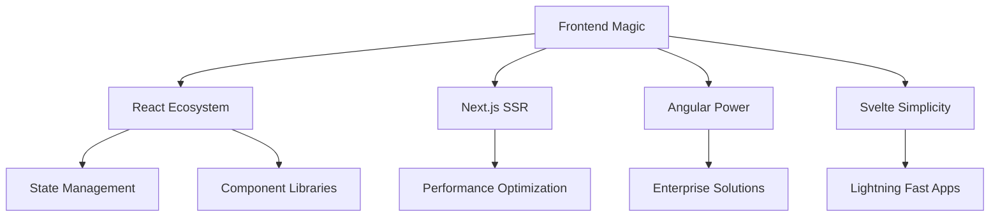

# ⚡ Welcome to My Digital Universe ⚡

<div align="center">
  
```ascii
    ___       ____ ____ ______ ____  __ _____
   /   |  ___/ / // /_  __/  _/ / / / /   |
  / /| | / _  / // /_ / /  _/ // /_/ / /| |
 / ___ |/ /_/ /__  __// /  _/ // __  / ___ |
/_/  |_|\____/  /_/  /_/  /___/_/ /_/_/  |_|
                                            
    🌌 Code • Create • Innovate • Inspire 🌌
```


</div>

---

<div align="center">

## 🎭 **WHO AM I?**

```python
class DigitalArchitect:
    def __init__(self):
        self.name = "Aditya Pandey"
        self.role = "Full-Stack Sorcerer & AI Whisperer"
        self.location = "🌍 Crafting code from Earth"
        self.current_mission = "Building the future, one commit at a time"
        
    def get_skills(self):
        return {
            "languages": ["Python", "TypeScript", "Rust", "Go", "Solidity"],
            "superpowers": ["🧠 AI/ML", "🌐 Web3", "📱 Mobile", "☁️ Cloud"],
            "philosophy": "Code is poetry written in logic"
        }
    
    def daily_routine(self):
        return ["☕ Coffee", "💻 Code", "🔄 Repeat", "🌙 Dream in binary"]
```


</div>

---

<div align="center">

## 🛠️ **MY ARSENAL OF DIGITAL WEAPONS**


</div>

<details>
<summary>🔮 <b>Core Languages</b> (Click to expand the magic)</summary>
<br>

<div align="center">

| Language | Mastery Level | Experience |
|----------|---------------|------------|
|  | ⭐⭐⭐⭐⭐ | `Master Pythonista` |
|  | ⭐⭐⭐⭐⭐ | `Type Safety Ninja` |
|  | ⭐⭐⭐⭐ | `Memory Safety Guardian` |
|  | ⭐⭐⭐⭐ | `Concurrency Wizard` |
|  | ⭐⭐⭐ | `Blockchain Architect` |

</div>

</details>

<details>
<summary>🎨 <b>Frontend Artistry</b></summary>
<br>



<div align="center">


</div>

</details>

<details>
<summary>⚙️ <b>Backend Engineering</b></summary>
<br>

<div align="center">

```
┌─────────────────────────────────────────────────────────┐
│                    Backend Arsenal                      │
├─────────────────────────────────────────────────────────┤
│ 🚀 Node.js & Express.js  │ 🐍 Django & FastAPI        │
│ 🔥 NestJS Architecture   │ 🌐 GraphQL APIs            │
│ 🔌 WebSocket Real-time   │ 🔐 Authentication & Auth   │
│ 📊 Database Design       │ 🛡️ Security Best Practices │
└─────────────────────────────────────────────────────────┘
```


</div>

</details>

<details>
<summary>🤖 <b>AI & Machine Learning Laboratory</b></summary>
<br>

<div align="center">

```python
# My AI Journey Map
ai_expertise = {
    "deep_learning": ["TensorFlow", "PyTorch", "Keras"],
    "nlp": ["Transformers", "BERT", "GPT", "LangChain"],
    "computer_vision": ["OpenCV", "YOLO", "CNN"],
    "ml_ops": ["MLflow", "Docker", "Kubernetes"],
    "data_science": ["Pandas", "NumPy", "Scikit-learn"]
}
```


</div>

</details>

<details>
<summary>🌐 <b>Web3 & Blockchain Realm</b></summary>
<br>

<div align="center">

| Blockchain | Smart Contracts | DeFi | NFTs |
|------------|-----------------|------|------|
|  |  | 🏦 | 🎨 |
|  |  | 📈 | 🔥 |
|  |  | 💰 | 🚀 |

</div>

</details>

---

<div align="center">

## 📊 **GITHUB BATTLE STATS**


<div style="display: flex; justify-content: center; align-items: center; gap: 10px;">


</div>


</div>

---

<div align="center">

## 🏆 **ACHIEVEMENT UNLOCKED**


</div>

---

<div align="center">

## ⚡ **CODING VELOCITY TRACKER**


</div>

---

<div align="center">

## 🌟 **CURRENT QUEST LOG**

```yaml
current_projects:
  - name: "AI-Powered Code Review Tool"
    status: "🔥 In Progress"
    tech_stack: ["Python", "Transformers", "FastAPI"]
    
  - name: "Decentralized Social Platform"
    status: "🚀 Planning Phase"
    tech_stack: ["Solidity", "React", "IPFS"]
    
  - name: "Neural Network Visualizer"
    status: "💡 Ideation"
    tech_stack: ["Three.js", "TensorFlow.js", "WebGL"]

learning_roadmap:
  - "🦀 Advanced Rust Programming"
  - "🌊 WebAssembly Optimization"
  - "🔮 Quantum Computing Basics"
  - "🚀 Advanced DevOps & MLOps"
```

</div>

---

<div align="center">

## 🎯 **CONNECT WITH THE ARCHITECT**


[](https://adpportfolio.vercel.app)
[](https://linkedin.com/in/adityaduttpandey)
[](https://github.com/Adityaadpandey)
[](mailto:adityapandeyadp@gmail.com)

</div>

---

<div align="center">

## 🐍 **CONTRIBUTION SNAKE - DEVOURING MY COMMITS**

<picture>
  <source media="(prefers-color-scheme: dark)" srcset="https://raw.githubusercontent.com/adityaadpandey/adityaadpandey/output/github-snake-dark.svg">
  <source media="(prefers-color-scheme: light)" srcset="https://raw.githubusercontent.com/adityaadpandey/adityaadpandey/output/github-snake.svg">
  
</picture>

</div>

---

<div align="center">


### 💫 *"In a world full of code, be the algorithm that makes a difference"*


```
⭐ Star some repositories if you find them interesting!
🍴 Fork projects you'd like to contribute to!
💬 Let's collaborate and build something amazing together!
```

</div>

---

<div align="center">

*Last Updated: Dynamically refreshed with each visit* 🔄

</div>
